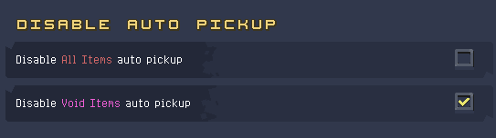

Content mod that adds Void items from RoR2, made for the RoRR mod jam.  
Made in collaboration with Klehrik.  

Some things are still incomplete/need to be polished.  

Tested in multiplayer.

With disableAutoPickup (included as a dependency), you can prevent your character from picking up Void Items automatically, even in multiplayer. The Settings are per client.

---

### Special Thanks To
* IDeathHD and especially hinyb for the shrimp color mid_hook
* digbug and all the others on the discord who have given feedback

### Installation Instructions
Install through the Thunderstore client or r2modman [(more detailed instructions here if needed)](https://return-of-modding.github.io/ModdingWiki/Playing/Getting-Started/).  
Join the [Return of Modding server](https://discord.gg/VjS57cszMq) for support.  

### Contact
For questions or bug reports, you can find us in the [RoRR Modding Server](https://discord.gg/VjS57cszMq) @Miguelito @Klehrik (not part of SmoothSpatula just a guest)